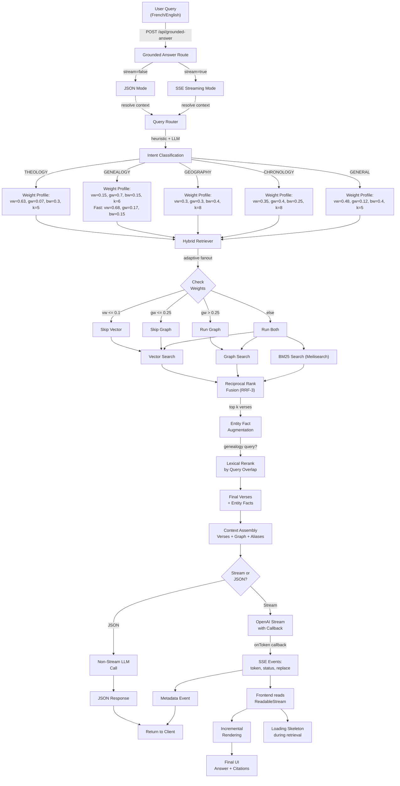

# Architecture: RAG + Graph + Router System

## System Overview

The Bible Search Engine combines four interacting systems to deliver accurate, contextualized biblical answers:

1. **Query Router (US-009)**: Intent classification + adaptive parameter tuning
2. **Hybrid Retriever**: Vector + Graph + BM25 search with adaptive fanout
3. **Context Injection & Grounded Answer (US-010)**: LLM-based answer generation with citation enforcement
4. **Streaming API (US-011)**: Real-time token streaming to frontend

---

## End-to-End Flow Diagram



---

## Component Details

### 1. Query Router (US-009)

**File**: `src/lib/query-router.ts`

**Purpose**: Classify query intent and tune hybrid search parameters

**Flow**:
```
Raw Query
  ↓
Normalize (NFD, lowercase, strip punctuation)
  ↓
Heuristic Intent Detection
  ├─ Keyword matching (EN + FR)
  ├─ Book/Testament extraction
  └─ Optional French canonicalization (LSG)
  ↓
[Fallback to intent config OR try LLM if heuristic uncertain]
  ↓
Output: { intent, vectorWeight, graphWeight, k, filters }
  ↓
[If genealogy + direct kinship pattern detected]
  └─ Apply fast profile: { vw: 0.8, gw: 0.2, k: 6 }
```

**Key Optimizations**:
- Kinship fast profile for genealogy: drops latency 6.6s → ~2s
- Christology keywords added (Jesus, Christ, Messias)
- GENERAL weight bumped to vector-only (0.8/0.2 to skip slow graph)

---

### 2. Hybrid Retriever

**File**: `src/lib/hybrid-retriever.ts`

**Purpose**: Three-path search combining semantic (vector), structural (graph), and lexical (BM25) retrieval

**Vector Path** (`vectorSearch`):
- Generate/cache query embedding via OpenAI
- MongoDB `$vectorSearch` on `embedding` field
- Apply book/testament filters
- Return top k results with `source: "vector"`

**Graph Path** (`graphSearch`):
- Tokenize query → match entity names/aliases in `entities` collection
- Use `verse.entity_slugs: { $in: [...] }` lookup
- Apply book/testament filters
- Fallback regex if no primary hits
- Return top k results with `source: "graph"`

**BM25 Path** (`bm25Search`):
- Queries `verses_bm25` in Meilisearch
- Applies optional filters (`book`, normalized `testament`)
- Returns ranked lexical matches with `source: "bm25"`
- Uses graceful degradation and circuit breaker fallback when Meilisearch is unavailable

**Adaptive Fanout** (New):
```
if (vectorWeight <= 0.1) skip vectorSearch
if (graphWeight <= 0.25) skip graphSearch
else run both with dynamic k multiplier
```

Result: For GENERAL/THEOLOGY (low graph weight), graph search is skipped entirely, saving 3–7s latency.

**Entity Enrichment**:
- Aggregation pipeline: match entities → lookup relations → resolve targets
- Score facts by: query overlap + verse presence + relation count + penalties
- Dedupe by normalized name, trim to top ~10 facts

**Lexical Re-ranking** (for genealogy):
- If query is genealogy pattern → re-rank verses by token overlap with query
- Example: Query "Joseph" → Genesis 46:19 (mentions "Joseph") ranks higher

---

### 3. Context Injection & Grounded Answer (US-010)

**File**: `src/lib/context-injection.ts` + `src/app/api/grounded-answer/route.ts`

**Purpose**: Assemble RAG context and generate grounded, cited answers

**Context Assembly**:
```
# Context
## Scriptures
[Verse Ref] Verse text
[Verse Ref] Verse text
...

## Knowledge Graph
Entity: Name (Type)
  Description: ...
  Aliases: ...
  Relations:
    - PARENT_OF -> Target
    - SON_OF -> Target

## Alias Mapping
Alias => Canonical Name
```

**System Prompt** (French, v2):
- Anti-hallucination guardrails
- Citation format: `[Livre Chapitre:Verset]`
- Markdown bold entities (`**name**`)
- Explicit graph relation exploitation
- Noise note: rely on text > auto-generated relations

**Generation Flow (Non-Stream)**:
1. Check if out-of-domain (e.g., "Elon Musk")
2. Assemble context from verses + entities
3. Call `openai.chat.completions.create({ response_format: { type: "json_object" } })`
4. Parse response: extract citations, validate against provided references
5. Return `{ answer, citations, uncertain }`

**Generation Flow (Stream - US-011)**:
1. Same checks + context assembly
2. Call `openai.chat.completions.create({ stream: true })`
3. For each chunk token: emit callback + SSE event
4. Collect full answer, extract/validate citations
5. Emit metadata event at end

---

### 4. Streaming API (US-011)

**File**: `src/app/api/grounded-answer/route.ts`

**SSE Event Protocol**:
```
event: status
data: { "phase": "retrieval_started" }

event: status
data: { "phase": "generation_started", "contextVerses": 5, "contextEntities": 2 }

event: token
data: { "token": "Jesus " }

event: token
data: { "token": "is " }

...

event: metadata
data: { "query": "...", "answer": "...", "citations": [...], "metadata": {...} }

event: done
data: { "ok": true }
```

**Frontend Consumption** (`src/app/page.tsx`):
1. Fetch `/api/grounded-answer` with `stream: true`
2. Read `response.body.getReader()`
3. Parse SSE blocks: `event: <name>\ndata: <json>`
4. Render tokens as they arrive (incremental)
5. Show retrieval skeleton during retrieval phase
6. On metadata event: display citations + stats

Result: TTFT (Time To First Token) < 1.5s after retrieval completes; no monolithic JSON wait.

---

## Performance Characteristics

### RRF-3 Formula

$$
score(d) = w_v \cdot \frac{1}{k + rank_v(d)} + w_g \cdot \frac{1}{k + rank_g(d)} + w_b \cdot \frac{1}{k + rank_b(d)}
$$

Where $w_v + w_g + w_b = 1$ and missing ranks contribute 0.

### Latency Breakdown

**Query: "Qui est Jésus ?" (THEOLOGY, fast profile)**

```
Phase 1: Routing (heuristic)         ~0ms
Phase 2: Vector Search                 ~1s (cold), ~100ms (warm)
Phase 3: Graph Search                  SKIPPED (gw=0.1 < 0.25)
Phase 4: RRF + Entity Enrichment      ~300ms
Phase 5: LLM Generation                ~1.5s (cold), ~500ms (warm)
─────────────────────────────────────────────
Total                                  ~2.8s (cold), ~0.6s+TTFT (stream)
```

**Query: "Qui est le fils de Joseph ?" (GENEALOGY, kinship fast)**

```
Phase 1: Routing (heuristic kinship)   ~0ms
         Apply fast profile: vw=0.8, gw=0.2, k=6
Phase 2: Vector Search                 ~1s (cold)
Phase 3: Graph Search                  SKIPPED (gw=0.2 < 0.25)
Phase 4: RRF + Lexical Rerank          ~300ms
Phase 5: LLM Generation                ~1.5s (cold)
─────────────────────────────────────────────
Total                                  ~2.8s (cold), genesis results (correct!)
```

*Without optimizations: ~6.6s with Matthew results (noisy graph)*

### Cache Benefits

- **Embedding cache**: Repeated "Jésus" queries reuse embedding (~100ms → ~10ms)
- **Retrieve cache**: Identical requests within 45s return cached results instantly
- **Combined**: Warm requests often <100ms total

---

## Data Flow Summary

```
User Query
  ↓
[Router] Intent + Weights
  ↓
[Retriever] 
  ├─ Adaptive Fanout Decision
  ├─ Vector Search (semantic)
  ├─ Graph Search (structural) [maybe skipped]
  ├─ RRF Fusion
  └─ Entity Enrichment
  ↓
[Context Injection]
  ├─ Assemble Scriptures + Graph + Aliases
  └─ Format for LLM
  ↓
[Grounded Answer]
  ├─ System Prompt (anti-hallucination)
  ├─ LLM Generation (stream or JSON)
  ├─ Citation Extraction & Validation
  └─ Return Answer
  ↓
[UI] (Stream or JSON)
  ├─ Incremental Rendering (if stream)
  ├─ Citations + Metadata
  └─ Final Answer
```

---

## Key Decisions

| Decision | Rationale |
|----------|-----------|
| **Adaptive Fanout** | Skip expensive searches when weight is low; saves 3–7s per query |
| **Kinship Fast Profile** | Genealogy queries wrongly routed to graph-heavy (slow + noisy); fast profile fixes both |
| **French LSG System Prompt** | Primary data source is LSG; all relation types + testament labels in French |
| **Citation Validation** | Enforce grounding: citations must come from provided context, not LLM hallucinations |
| **SSE Streaming** | No proprietary libs needed; native Next.js + OpenAI stream API; TTFT <1.5s |
| **Load Skeleton** | Show progress during retrieval phase; prevents UX confusion during slow DB queries |

---

## Monitoring & Observability

### Logs Emitted

- `[query-router] Routing decision`: intent, source, weights, latency
- `[hybrid-search][route-plan]`: full routing metadata
- `[grounded-answer] Error`: stream or JSON mode failures
- `[context-injection] Out-of-domain query`: caught hallucination attempts

### Metrics to Track

- Intent distribution (what % genealogy vs theology?)
- Cache hit ratio (embedding + retrieve caches)
- Graph skip rate (should be high for GENERAL/THEOLOGY)
- TTFT for streaming queries
- Citation validation failure rate

---

## Future Enhancements

1. **Re-ranking with cross-encoder**: Replace RRF with learned fusion (monoT5-style)
2. **Multi-hop graph traversal**: Follow entity chains beyond first relation
3. **Confidence scores**: Return LLM confidence + retrieval uncertainty
4. **Prompt routing**: Different prompts for different intents (genealogy vs theology)
5. **Multi-language UI**: Render in English/French/Spanish
6. **Citation links**: Make citations clickable → jump to verse in UI

